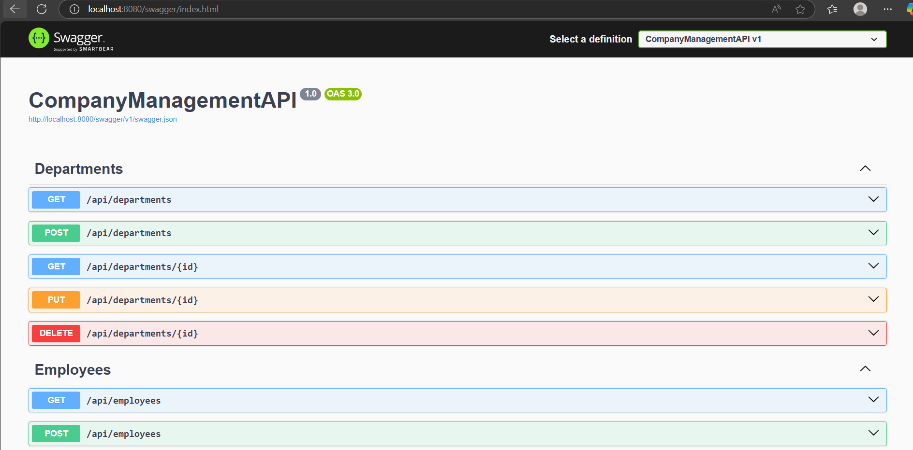

# 🛠 Employee, Department & Project Management API

This is a .NET 9 Web API that allows you to manage Employees, Departments, and Projects.  
The API uses **FluentValidation**, **Entity Framework Core**, and is containerized using **Docker Compose** for easy setup.

---

## 📦 Features

- **Minimal APIs** using .NET 9 for lightweight, expressive route definitions
- Create, update, delete, and fetch employees
- Assign employees to departments and projects
- Validation using FluentValidation
- API documentation using Swagger
- Containerized with Docker and Docker Compose
- Unite test written using xunit

---

## 🚀 Getting Started

### 🔧 Prerequisites
#### Quick Installation
- [Docker Desktop](https://www.docker.com/products/docker-desktop)
  
#### Development
Make sure the following tools are installed:

- [.NET 9 SDK](https://dotnet.microsoft.com/en-us/download/dotnet/9.0)
- [Docker Desktop](https://www.docker.com/products/docker-desktop)
- [Git](https://git-scm.com/)
  

---

## 🧰 Running the API Locally (Using Docker Compose)

### 1️⃣ Clone the Repository

```bash
git clone https://github.com/yourusername/your-repo-name.git
cd your-repo-name
```

### 2️⃣ Build and Run the Project
```bash
docker-compose up --build
```

This will:
- Build the API image
- Set up a SQL Server container
- Run database migrations

> [!NOTE]
> Access the API at http://localhost:8080. 

## Access API Documentation
Once the containers are running, open your browser:

 Swagger UI
 http://localhost:8080/swagger/index.html



Use Swagger to test all available endpoints.
### 3️⃣Running Unit Tests
To run unit tests, navigate to the test project directory and run:
```
dotnet test
```
